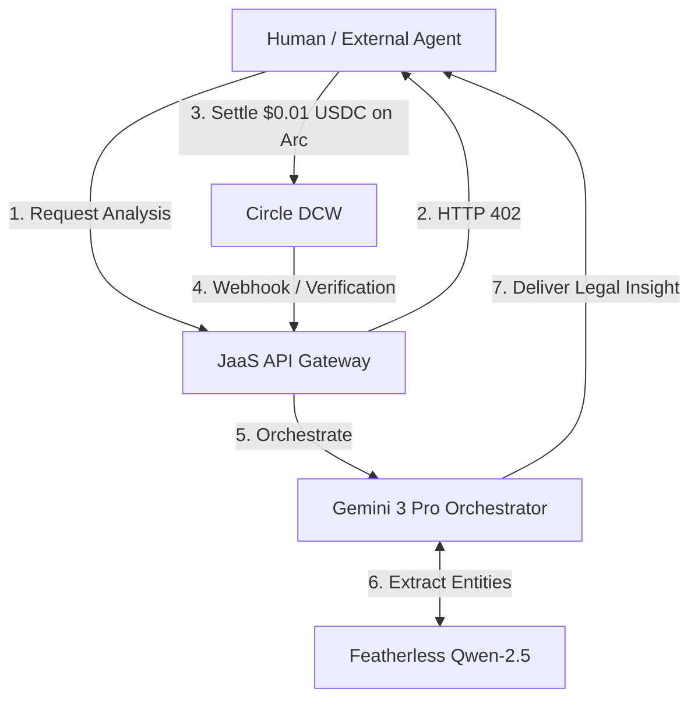

# JaaS — Jurisprudence-as-a-Service
> **The Economic OS for Legal Intelligence.** ⚖️ 
> AI-powered jurisprudence orchestration with sub-cent USDC nanopayments on Arc.

[](https://lablab.ai/ai-hackathons/nano-payments-arc)
[](https://www.arc.network/)
[](https://developers.circle.com/)
[]()

---

## 🎬 Hackathon Submission Assets
- **[Live Demo Application](https://jaas-demo.vercel.app)** *(Replace with your Vercel URL)*
- **[Pitch & Technical Demo Video](https://youtube.com/...)** *(Replace with your YouTube URL)*
- **[Strategic Product Feedback (Circle)](docs/circle-feedback.md)** - *Deep technical review of the DCW SDK & Arc.*

---

## 🏛️ Vision
JaaS is a **Jurisprudence-as-a-Service** orchestration engine designed for the Agentic Economy. We believe that in the era of AI agents, legal intelligence shouldn't be locked behind rigid monthly subscriptions. JaaS enables autonomous agents and developers to consume high-fidelity legal reasoning, entity extraction, and doctrinal analysis via **real-time nanopayments**.

Each query costs **$0.01 USDC**, settled with deterministic sub-second finality on the **Arc blockchain**—making a per-action business model not just possible, but highly profitable (79%+ net margins).

## 🚀 Key Innovation: The x402 Payment Loop
JaaS implements the **HTTP 402 Payment Required** protocol for machine-to-machine commerce. 
1. **Agent** requests legal analysis.
2. **JaaS** returns a `402` status with x402 payment headers.
3. **Agent** signs a USDC authorization via **Circle Wallets**.
4. **JaaS** verifies settlement on **Arc** and delivers the intelligence.

---

## 🧠 The Agentic Workflow



---

## 🛠️ Built With (Strategic Partners)

| Layer | Technology | Role |
|-------|------------|------|
| **Settlement** | **Arc (Circle L1)** | High-frequency, USDC-native gas settlement layer. |
| **Wallets** | **Circle Web3 Services** | Developer-Controlled Wallets for secure agent treasury management. |
| **Orchestrator** | **Google Gemini 3 Pro** | High-fidelity legal reasoning and multimodal understanding. |
| **Extraction** | **Featherless AI** | Specialized model routing (Qwen-2.5) for structured legal entity extraction. |
| **Infrastructure** | **AI/ML API** | Unified gateway for resilient AI model access and cost tracking. |

---

## 📊 Margin Economics (The Proof)
Traditional blockchain gas costs (L1/L2) erode the margins of micro-transactions. JaaS on Arc proves economic viability:
- **Revenue per Query:** $0.01000 USDC
- **Inference Cost:** $0.00200 USDC
- **Arc Gas Fee:** $0.00001 USDC
- **Net Margin:** **79.9%**

---

## 💻 Tech Stack & Architecture

- **Frontend:** Next.js 14, Vanilla CSS (Enterprise Luxury/Neo-skeuomorphism).
- **Backend:** Node.js, Express, TypeScript.
- **Security:** Zod (Input Sanitization), Helmet, RSA-encrypted Entity Secrets.
- **Persistence:** Redis-backed RAM cache for 64GB Workstation optimization.

### Quick Start

```bash
# Clone and install
git clone <repository-url>
cd JaaS
npm install

# Setup credentials (from .env.example)
cp .env.example .env

# Run Traffic Simulation (50+ on-chain transactions)
npm run simulate-traffic

# Start Development
npm run dev:server
npm run dev:client
```

---

## 📄 Documentation
- [System Architecture](docs/architecture.md)
- [API Specification](docs/api-spec.md)

---
*Developed for the Agentic Economy on Arc Hackathon. 2026.*
